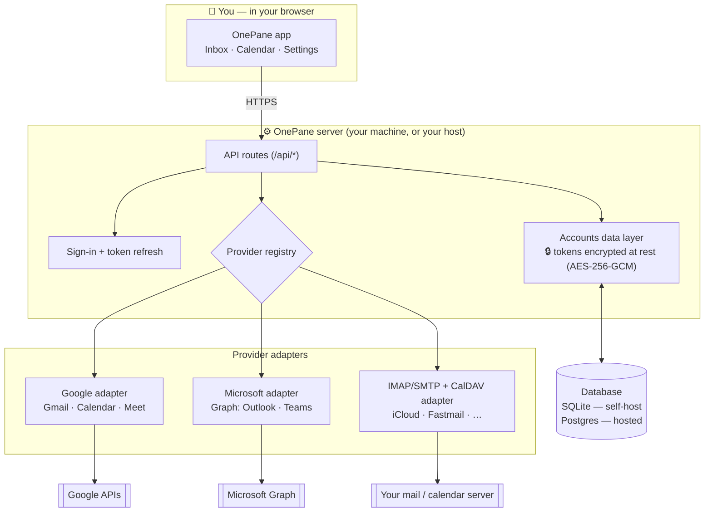
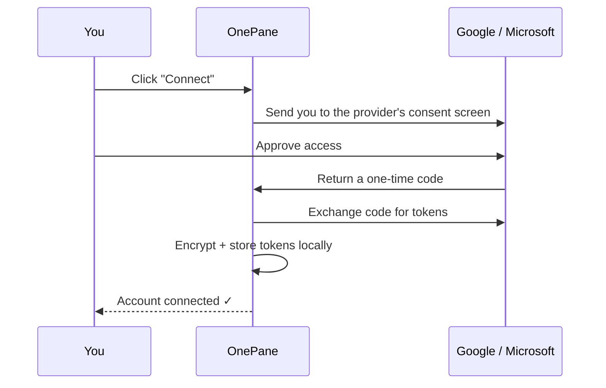

# OnePane

**All your email inboxes and calendars in one place — across every account you own.**

Your phone shows every inbox and calendar together. Your laptop browser makes you keep a tab open per account and switch all day. OnePane fixes that: connect any number of **Google**, **Microsoft**, and **IMAP/CalDAV** (iCloud, Fastmail, …) accounts and get **one unified inbox** and **one unified calendar**, colour-coded by account — that you run yourself, with your data staying on your own machine.

Read mail across every account, **triage** it (delete, archive, mark read, star, label), **search**, **draft**, and **reply/compose from any account**. See all your calendars overlaid, and **create invites** with a **Google Meet** link, a **Microsoft Teams** meeting, or a **physical location** linked to Google Maps.

> New here? Jump to **[Set it up on your own computer](#-set-it-up-on-your-own-computer)** — it's written for non-developers, step by step.

---

## Contents

- [What it can do](#what-it-can-do)
- [How it works (architecture)](#how-it-works-architecture)
- [Choose your path](#choose-your-path)
- [🖥️ Set it up on your own computer](#-set-it-up-on-your-own-computer)
  - [Step 1 — Install Node.js](#step-1--install-nodejs)
  - [Step 2 — Get OnePane](#step-2--get-onepane)
  - [Step 3 — Create a Google sign-in (one time)](#step-3--create-a-google-sign-in-one-time)
  - [Step 4 — Start OnePane & connect your account](#step-4--start-onepane--connect-your-account)
  - [Keep it always-on (optional)](#keep-it-always-on-optional)
  - [Microsoft and other (IMAP/CalDAV) accounts](#microsoft-and-other-imapcaldav-accounts)
- [🌐 Put it online for other people (free)](#-put-it-online-for-other-people-free)
- [Security & privacy](#security--privacy)
- [Tech stack](#tech-stack)
- [Project layout](#project-layout)
- [Troubleshooting](#troubleshooting)
- [Roadmap & contributing](#roadmap--contributing)
- [License](#license)

---

## What it can do

**Mail (across all connected accounts at once)**
- Unified inbox, colour-coded by account; **search**; **conversation threading**.
- **Compose & reply** from whichever account you choose.
- **Triage:** delete (→ Trash), archive, mark read/unread, star — with optimistic updates and undo.
- **Labels / folders:** view, filter by, move to, and create.
- **Drafts:** save, edit, send, delete.
- **Attachments:** view & download received files; attach files when composing.

**Calendar**
- Unified month / week / agenda views across every account and **every calendar**.
- **Create invites** with attendees and a **Google Meet** link, **Microsoft Teams** meeting, or an in-person address linked to **Google Maps**.
- **Edit / delete** events and **RSVP** (accept / tentative / decline).

**Accounts**
- **Google** (Gmail + Calendar + Meet), **Microsoft** (Outlook + Calendar + Teams), and generic **IMAP/SMTP + CalDAV** (iCloud, Fastmail, and more).
- **Local-first:** your data and your access tokens live on your machine, encrypted.

---

## How it works (architecture)



In plain English: the **browser** only ever talks to **OnePane's own server**, which holds your **encrypted** account tokens and talks to Google / Microsoft / your mail server on your behalf. Adding a new provider is just another **adapter** behind the registry.

Connecting an account uses standard OAuth — you approve access on the provider's own page, and OnePane only stores tokens (never your password):



---

## Choose your path

| You want to… | Use | Difficulty |
| --- | --- | --- |
| Use OnePane yourself, privately | **[Self-host](#-set-it-up-on-your-own-computer)** | Beginner-friendly, ~15 min |
| Let other people sign in online | **[Host it](#-put-it-online-for-other-people-free)** | Intermediate; needs a free Vercel + database |

You don't need to be a developer for the self-host path — just follow the steps.

---

## 🖥️ Set it up on your own computer

This runs OnePane privately on your own machine. Everything stays local.

### Step 1 — Install Node.js
OnePane needs **Node.js 20 or newer**. Download the "LTS" installer from **[nodejs.org](https://nodejs.org)**, run it, then check it worked — open a terminal (macOS: *Terminal*; Windows: *PowerShell*) and run:
```bash
node -v
```
You should see something like `v22.x` or higher.

### Step 2 — Get OnePane
In the terminal:
```bash
git clone https://github.com/BeardOnTheBlock/onepane.git
cd onepane
npm install
cp .env.example .env
```
Then create a secret key (this encrypts your tokens) and paste it into `.env` as `ONEPANE_ENCRYPTION_KEY`:
```bash
openssl rand -base64 32
```
> On Windows without `openssl`, run `node -e "console.log(require('crypto').randomBytes(32).toString('base64'))"` instead.

Finally, set up the local database:
```bash
npm run setup
```

### Step 3 — Create a Google sign-in (one time)
To read your Gmail/Calendar, OnePane needs its own Google "OAuth client". This is free and only takes a few minutes. Open **[console.cloud.google.com](https://console.cloud.google.com)** signed in with your Google account, then:

1. **Make a project** → [console.cloud.google.com/projectcreate](https://console.cloud.google.com/projectcreate) → name it `OnePane` → **Create** → select it (top-left dropdown).
2. **Turn on the two APIs** (this *must* be done before the scopes appear):
   - [Enable Gmail API](https://console.cloud.google.com/apis/library/gmail.googleapis.com) → **Enable**
   - [Enable Google Calendar API](https://console.cloud.google.com/apis/library/calendar-json.googleapis.com) → **Enable**
3. **Consent screen** → [console.cloud.google.com/auth/overview](https://console.cloud.google.com/auth/overview) → **Get started** → App name `OnePane`, your email; **Audience: External**; finish.
4. **Add yourself as a test user** → on the **Audience** page → **Test users → Add users** → your Google email. (Keep the app in **Testing** — only your listed test users can connect, which is exactly what you want.)
5. **Add the scopes** → **Data Access → Add or remove scopes** (or use **Manually add scopes**) → add:
   ```
   https://www.googleapis.com/auth/gmail.modify
   https://www.googleapis.com/auth/calendar
   ```
6. **Create the client** → **Clients → Create client** (older UI: *Credentials → Create credentials → OAuth client ID*) → type **Web application** → under **Authorized redirect URIs** click **+ Add URI** and paste exactly:
   ```
   http://localhost:6969/api/connect/google/callback
   ```
   *(If it also demands an "Authorized JavaScript origin", put `http://localhost:6969` there — no path, no trailing slash.)* → **Create** → copy the **Client ID** and **Client secret**.

### Step 4 — Start OnePane & connect your account
```bash
npm run dev
```
Open **<http://localhost:6969>** → go to **Settings** → **Set up Google** → paste your **Client ID & Secret** (stored encrypted locally — no `.env` editing needed) → **Save** → **Connect Google**.

On Google's screen you'll see an **"unverified app"** warning — that's expected for your own personal app. Click **Advanced → Go to OnePane (unsafe)** (safe, it's *your* app) → **Allow**. You're in. 🎉 Connect as many accounts as you like.

### Keep it always-on (optional)
`npm run dev` only runs while the terminal is open. To have OnePane always available at `localhost:6969` and start automatically when you log in (macOS):
```bash
npm run service:install      # build + run as a background login service
```
Manage it with `npm run service:status` / `service:logs` / `service:restart` / `service:rebuild` / `service:uninstall`. Linux (systemd) and cross-platform (pm2) instructions are in **[`docs/PERSISTENCE.md`](docs/PERSISTENCE.md)**.

### Microsoft and other (IMAP/CalDAV) accounts

<details>
<summary><strong>Microsoft (Outlook + Teams)</strong></summary>

Register an app at **[entra.microsoft.com](https://entra.microsoft.com)** → *App registrations → New registration*; supported account types "any org + personal"; add a **Web** redirect URI `http://localhost:6969/api/connect/microsoft/callback`; create a **client secret**; under **API permissions** add Microsoft Graph delegated: `User.Read`, `Mail.ReadWrite`, `Mail.Send`, `Calendars.ReadWrite`, `OnlineMeetings.ReadWrite`, `offline_access`. Then in OnePane **Settings → Set up Microsoft**. Full walkthrough: [`docs/OAUTH_SETUP.md`](docs/OAUTH_SETUP.md). *(Teams meetings need a work/school account, not personal outlook.com.)*
</details>

<details>
<summary><strong>iCloud / Fastmail / any IMAP mailbox</strong></summary>

In OnePane go to **Settings → Other (IMAP / CalDAV)**, pick a preset (iCloud / Fastmail) or **Custom**, and enter your email + an **app-specific password** (iCloud and Gmail require an app password, not your normal one) + optional CalDAV URL. OnePane verifies the connection before saving.
</details>

---

## 🌐 Put it online for other people (free)

Want a real website where you (and friends) sign in with Google — no setup on their end? That's the **hosted, multi-user** build on the **`feat/hosted-multiuser`** branch (it adds app login + Postgres; the single-machine `main` build stays as-is).

> **Read this first — the one real cost.** A public "anyone can sign in" Gmail app must be **verified by Google**, and `gmail.modify` is a *restricted* scope that requires a paid **annual security assessment (CASA)** to lift the limits. **Until verified you can have up to 100 users for free** (Google "Testing" mode) — perfect for yourself + friends + a beta. Going fully public/unlimited is where the cost comes in.

**Deploy (free tier), ~20 minutes:**

1. **Vercel** → [vercel.com](https://vercel.com) → sign in with GitHub → **Add New → Project** → import `BeardOnTheBlock/onepane` → set **Production Branch = `feat/hosted-multiuser`**.
2. **Database** → in the project, **Storage → Create → Neon Postgres** → connect (this sets `DATABASE_URL` automatically).
3. **Environment variables** (Settings → Environment Variables); generate the two secrets with `openssl rand -base64 32`:
   ```
   AUTH_SECRET                = <random>
   ONEPANE_ENCRYPTION_KEY     = <random>
   GOOGLE_CLIENT_ID           = <your OAuth client id>
   GOOGLE_CLIENT_SECRET       = <your OAuth client secret>
   NEXT_PUBLIC_ONEPANE_HOSTED = true
   APP_URL                    = https://<your-app>.vercel.app   (set after first deploy)
   ```
4. **Deploy** → you'll get a `https://<your-app>.vercel.app` URL.
5. **Create the database tables** — pull the env locally and push the schema once:
   ```bash
   git checkout feat/hosted-multiuser
   vercel env pull .env.production.local
   DATABASE_URL="<your Neon URL>" npx prisma db push
   ```
6. **Google OAuth for the live URL** → in your Google client add **two** redirect URIs:
   ```
   https://<your-app>.vercel.app/api/auth/callback/google     (login)
   https://<your-app>.vercel.app/api/connect/google/callback  (connecting mailboxes)
   ```
   Keep the app in **Testing** and add users as **Test users** (≤100, free).
7. **Visit your URL → Sign in with Google → connect your mailbox.** Done — share the link with anyone you've added as a test user.

The architecture is identical to the diagram above, except the database is **Postgres** and every request is **scoped to the signed-in user** (per-user data isolation). To go beyond 100 users / remove the warning, complete Google's verification (paid CASA).

---

## Security & privacy

- **Runs on your machine** (self-host) — there's no OnePane company, account, or telemetry.
- **Tokens encrypted at rest** with AES-256-GCM (key from `ONEPANE_ENCRYPTION_KEY`); a leaked database file alone exposes nothing usable.
- **Your password is never seen by OnePane** — Google/Microsoft sign-in happens on *their* pages; OnePane only receives tokens. (IMAP uses an app-specific password you control.)
- **HTML email is sandboxed** in an isolated `<iframe>` so remote content/scripts can't run against the app.
- The only outbound calls are to Google, Microsoft, and your own mail/calendar servers.

---

## Tech stack

Next.js 15 (App Router) · React 19 · TypeScript · Tailwind CSS + shadcn/ui · Prisma (SQLite self-host / Postgres hosted) · SWR · Auth.js (hosted) · Gmail API · Google Calendar API · Microsoft Graph · IMAP/SMTP (imapflow + nodemailer) · CalDAV (tsdav + ical.js).

## Project layout

```
src/
  app/                 # pages (inbox, calendar, settings) + API routes
  components/          # UI (shadcn primitives + inbox/calendar/settings)
  hooks/               # SWR data hooks
  lib/
    types.ts           # shared contracts (one source of truth)
    crypto.ts          # AES-256-GCM token encryption
    oauth.ts           # OAuth flow + token refresh
    accounts.ts        # accounts data layer (encrypt/decrypt)
    providers/         # google.ts · microsoft.ts · imap.ts · caldav.ts (+ registry)
prisma/schema.prisma   # database schema
docs/                  # OAUTH_SETUP.md · PERSISTENCE.md · ARCHITECTURE.md
scripts/               # macOS launchd service (always-on)
```

## Troubleshooting

- **`localhost:6969` won't open** → the dev server isn't running. Run `npm run dev` in the `onepane` folder and keep that terminal open (or install the always-on service).
- **Scopes only show `email`/`profile`** → enable the Gmail + Calendar APIs first (Step 3.2), or use "Manually add scopes".
- **`redirect_uri_mismatch`** → the redirect URI in Google must match *exactly* `http://localhost:6969/api/connect/google/callback`.
- **"Invalid Origin: must not contain a path"** → you pasted the callback URL into *Authorized JavaScript origins*; it belongs in *Authorized redirect URIs*. Origins only take `http://localhost:6969`.
- **"Access blocked: …has not completed verification"** → add your Google address as a **Test user** (Step 3.4) and keep the app in **Testing**.
- **Inbox empty but no error** → make sure the account is connected in Settings; OnePane fetches recent mail per account.

## Roadmap & contributing

Possible next steps: richer search, conversation actions, drag-to-reschedule on the calendar, more providers. The provider abstraction is small — implement `MailProvider` / `CalendarProvider` from [`src/lib/types.ts`](src/lib/types.ts) and register them in [`src/lib/providers/index.ts`](src/lib/providers/index.ts). See [`CONTRIBUTING.md`](CONTRIBUTING.md) and [`docs/ARCHITECTURE.md`](docs/ARCHITECTURE.md). PRs welcome.

## License

[MIT](LICENSE) © 2026 BeardOnTheBlock
